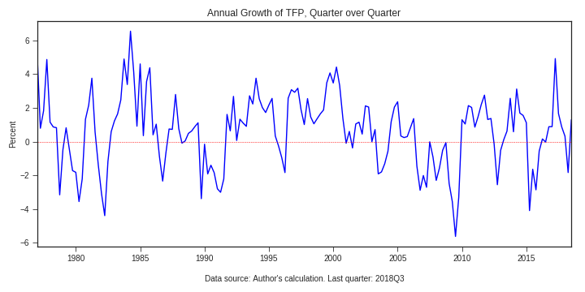

## Shutao Cao

### Data project

#### Seasonally-adjusted Quarterly Total Factor Productivity in Canada

The seasonally adjusted series of quarterly total factor productivity (TFP) in Canadian business sector is estimated following the method by Diewert and Yu (2012). The estimated quarterly TFP is not adjusted for capacity utilization.

Link to data: [tfpQtr1976_2018Web.ods](https://www.dropbox.com/s/wdbo07tee52e9qi/tfpQtr1976_2018Web.ods?dl=0). Link to [paper](https://shutaocaoecon.files.wordpress.com/2019/01/quarterlytfp20190121.pdf).

Previously, my co-author and I estimated the seasonally unadjusted series of quarterly TFP, these data are not maintained, nor updated. Link to the [paper](http://www.bankofcanada.ca/wp-content/uploads/2015/02/wp2015-6.pdf).   